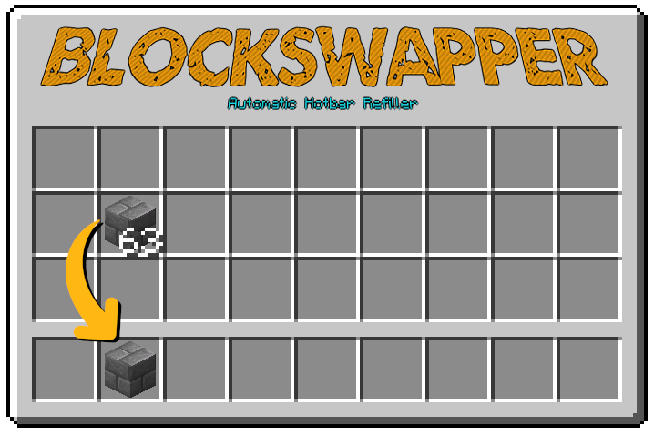

# BlockSwapper

BlockSwapper is a simple, lightweight plugin that automatically refills a players hotbar when they are building, if they have additional blocks of the same type in their inventory.

It does this by detecting when a survival mode player places the last block in a stack and automatically searches their inventory for stacks of the same material. It then moves the first stack it finds into their hotbar.

### Permissions

There is only one permission: `blockswapper.use` - this allows a player to benefit from this plugin.

### Config

There is no configuration for this plugin.

### Support and Suggestions

If you have a suggestion for how to improve this plugin, or an issue while using it, please join the support discord https://discord.gg/yJthQdW5Ja
